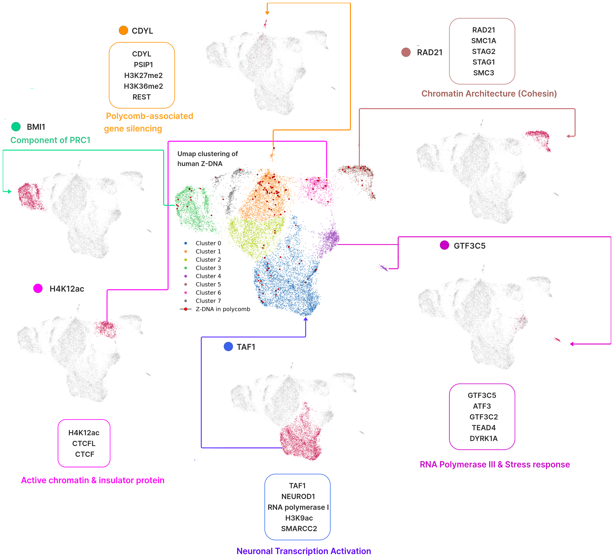

**The role of secondary DNA structures in neuron-specific regulation by Polycomb repressive complexes (PRC)**
> **Rakhimov Bulat** HSE University  
> tg: @bulatych_7  
> brrakhimov@hse.edu.ru  

This repository contains the results of the semester project at the Bioinformatics Institute

**Supervisor**: Maria Poptsova, Ekaterina Khrameeva

**Objective**

The 3D genome organization in human neurons differs significantly from other cell types. A hallmark feature is the presence of long-range interactions called “neuronal dots,” visible on Hi-C maps and overlapping with H3K27me3 ChIP-seq peaks linked to Polycomb-mediated repression [Pletenev 2024](https://academic.oup.com/nar/article/52/11/6234/7655789?login=false). It has been experimentally demonstrated that PRC2 complex components associate with G-quadruplex structures, and that there is specific binding of the CTCF protein to G-quadruplexes [Hemphill et al.](https://pmc.ncbi.nlm.nih.gov/articles/PMC10266057/) 
This study explores the localization of Z-DNA and G-quadruplexes at PRC2 anchor regions in neurons.

**Goals**

1. Investigate the localization of G-quadruplexes(G4s) and Z-DNA at PRC2 anchor regions in human neurons. Examine the enrichment of these secondary DNA structures in promoter regions  of both transcription factor (TF) and non-transcription factor (non-TF) genes of polycomb anchor regions.

2. Perform gene ontology analysis to link the identified regions to relevant biological processes. Examine tissue-specifity for genes intersected with Z-DNA and G4s.

3. Utilize UMAP clustering to explore how experimental and predicted Z-DNA regions group and are characterized by various omics features in neuronal tissue. Higlight the clustering patterns of Z-DNA regions that overlap with PRC2 anchors. Implement feature importance analysis of these omics vectors.

**Results**

1. Significant enrichment of Z-DNA and G-quadruplexes was observed at PRC2 anchor regions in neurons, particularly within the promoter regions of both TF and non-TF genes.

  

    
    

      Figure 1. Permutation test for Z-DNA: comparison of the overlaps distribution of Z-DNA with all transcription factor (TF) genes and with TF genes in polycomb-associated regions.
    

  

  
  

    
    

      Figure 2. Permutation test for G-quadruplexes: comparison of the overlaps distribution of G-4 with all TF genes and with TF genes in polycomb-associated regions.
    

  

 
2. Gene ontology analysis revealed strong associations of these loci with neuronal development, chromatin remodeling, and transcriptional repression pathways. Tissue enrichment analysis confirmed that some genes are highly expressed in the brain, as well as in other tissues.

   

  

    
    

      Figure 3. Gene Ontology analysis of transcription factor (TF) genes associated with G-quadruplexes (G4)
    

  

  

    
    

      Figure 4. Gene Ontology analysis of non-TF genes associated with Z-DNA structures. Enriched biological processes (BP) are displayed
    

  

  
  

  Figure 5. Gene Ontology analysis of Non-TF genes associated with Z-DNA structures: Molecular Function (left) and Cellular Component (right)

  

    
    

      Figure 6. Tissue enrichment analysis of genes overlapping Z-DNA regions. Barplot shows -log10(p-value) of enrichment across 29 human tissues from GTeX dataset
    

  

  

    
    

      Figure 7. Tissue-specific genes associated with Z-DNA. Heatmap displays expression enrichment of Z-DNA-linked genes in selected tissues
    

  

   

3. UMAP clustering revealed that Z-DNA regions exhibit distinct patterns when characterized by omics features in neuronal tissue. The analysis identified several key clusters associated with transcriptional regulation, chromatin organization, and Polycomb-mediated repression and  highlighted key signals, including transcription factors, histone marks, RNA Polymerase II and III binding sites for neurons. Z-DNA regions overlapping with PRC2 anchors exhibited a similar clustering pattern to other regions (Fig. 8).  Notably, most of the Z-DNA regions (48%) overlapping with PRC2 anchors are clustered with omics features associated with Polycomb-mediated repression.

Figure 8. UMAP clusters of human Z-DNA with one top marker feature highlighted for each cluster

**Conclusion**

 Our findings suggest that secondary DNA structures such as Z-DNA and G-quadruplexes are enriched at PRC2 anchor regions in human neurons and may play a role in Polycomb-mediated gene regulation. Their association with key regulatory features and neuronal gene expression points to a potential involvement in shaping the unique chromatin landscape of neuronal cells.

**Contents**

All results are available in the `imgs` directory. Scripts and notebooks for overlap analysis, permutation testing, and GO enrichment are located in the `scripts` and `notebooks` directories, respectively. The defined DNA regions overlapping with polycomb anchors can be found in the `intersections` folder. The UMAP clustering is shown in `UMAP.ipynb`.

**Raw data**

- `HG38_ZDNA_ZDNABERT_predictions_thr_0.25_minlen_6.bed` - predicted regions of Z-DNA with ZDNABERT

- `HG38_G4_predictions_thr_0.25_minlen_6.bed`, - predicted regions of G-quadruplexes based on [Endoquad](https://academic.oup.com/nar/article/52/D1/D72/7334091) database with strand

- `polycomb_dot_anchors.bed` - Polycomb anchor regions with genes, identifying long-range interactions characteristic of neuronal dots.

- `gencode.v47.chr_patch_hapl_scaff.basic.annotation.gtf.gz` - Gene annotation file GENCODE v47 of GRCh38 assembly

- `Experiment_and_predicted_z_dna_ Neural_omics` - A matrix of overlapping Z-DNA regions with neural omics data (transcription factor binding, histone marks, RNA Polymerase II/III binding sites, DNase hypersensitive sites)
- `All_nonTF_genes_GRCh38.csv`; `All_TF_genes_GRCh38.csv` - All TF and nonTF genes for GRCh38

Extracted transcription factor (TF) and non-transcription factor (non-TF) genes that are present in polycomb regions and contain Z-DNA or G-quadruplexes can be found in `TF_and_not_TF_genes` folder

The **omics data** is too large to keep in GitHub.

It can be downloaded from [Chip-atlas](https://chip-atlas.org/) using the custom Python notebook `Example.ipynb`, created by the [HSE Bioinformatics Lab](https://github.com/hse-bioinflab/OmicsDC).

**References** 
- [Pletenev IA et al.(2024). Extensive long-range polycomb interactions and weak compartmentalization are hallmarks of human neuronal 3D genome. _Nucleic acids research_, 52(11), 6234–6252.](https://academic.oup.com/nar/article/52/11/6234/7655789?login=false)
- [Hemphill WO et al.(2023). PRC2 direct transfer from G-quadruplex RNA to dsDNA has implications for RNA-binding chromatin modifiers. _Proceedings of the National Academy of Sciences of the United States of America_, 120(23), e2220528120.](https://pmc.ncbi.nlm.nih.gov/articles/PMC10266057/)
- [Beknazarov N, Jin S & Poptsova M (2020). Deep learning approach for predicting functional Z-DNA regions using omics data. _Scientific reports_, 10(1), 19134.](https://pubmed.ncbi.nlm.nih.gov/33154517/)
- [Beknazarov N et al.(2024). Z-DNA formation in promoters conserved between human and mouse are associated with increased transcription reinitiation rates. _Sci Rep_, 14, 17786.](https://www.nature.com/articles/s41598-024-68439-y)
- [Sheng Hu Qian et al. (2024). EndoQuad: a comprehensive genome-wide experimentally validated endogenous G-quadruplex database, _Nucleic Acids Research_, 52(D1), D72–D80.](https://academic.oup.com/nar/article/52/D1/D72/7334091#434768924)
- [Zhaonan Zou et al. (2024). ChIP-Atlas 3.0: a data-mining suite to explore chromosome architecture together with large-scale regulome data, _Nucleic Acids Research_, 52(W1), W45–W53.](https://academic.oup.com/nar/article/52/W1/W45/7671323)
